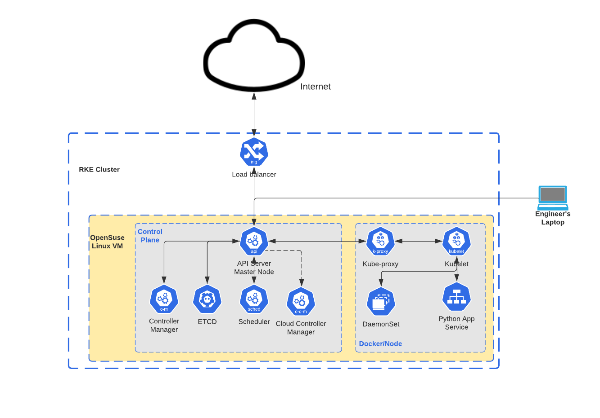
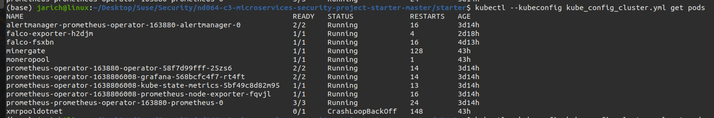

## Project Description
This project is part of the submission of the Udacity Suse Cloud Native Application Architecture Nanodegree. The starter files for this project 
can be cloned from [here]()

### Background
Security is a highly dynamic topic with ever changing threats and priorities. Newsworthy topics ranging from fortune 500 companies like [Garmin](https://www.wired.com/story/garmin-ransomware-hack-warning) paying $10 million in ransom for ransomware attacks to supply chain attacks such as [Solarwinds](https://www.cnet.com/news/solarwinds-hack-officially-blamed-on-russia-what-you-need-to-know) are ever-present. 

Security is becoming harder as the velocity of deployments is accelerating. The [Synopsis 2020 Open Source Security Risk Analysis Report](https://webcache.googleusercontent.com/search?q=cache:yUCraGVAdw8J:https://www.synopsys.com/content/dam/synopsys/sig-assets/reports/2020-ossra-report.pdf+&cd=1&hl=en&ct=clnk&gl=us) revealed that 99% of audited code bases contained open source, and within those codebases 75% of vulnerabilities were left unpatched, creating risk. Incorporating security checks into each step of the build and deployment process is vital to identify security defects before they hit production.

### Goal 
Goal of the project is to build a secure Microservice environment, threat modeling and hardening the container image, run-time environment and application itself. For purposes of the project, we used a secure base opensuse image, covering considerations for the importance of using trustworthy base images and verifing the baselein. We build, harden, ship and run an environment analogous to the company's new microservice application, simplified for project purposes. We defined and built a new environment from the ground-up. 

In a real-world scenario, we may have an existing envrionment that needs to be hardened or may decided to re-build parts or all net-new, regardless, the tools and techniques in the project are directly applicable. The beauty of microservices vs a monolith architecture is that all core components (image, container, run-time, application) are abstracted allowed for isolation boundaries and iterative development. In the real-world, we could chose to harden and redeploy all base-images as one project phase and tackle docker container security, kubernetes hardening and the software composition anaylsis, as individual project phases. The best approach is to bake these requirements and security hardening into the build and deploy process. In an enterprise setting, much of this can be enforced with security units test via CI/CD prior to deployment. Hardening the base-image and baking security into the CI/CD is beyond the scope of this project and course, however please reference the [additional considerations](https://github.com/udacity/nd064-c3-Microservices-Security-project-starter/tree/master/starter#additional-considerations) section for more on this. 

For the project, once the Microservice environment is hardened and provisioned, we configured [sysdig Falco](https://github.com/falcosecurity/falco) to perform run-time monitoring on the node, sending logs to a Grafana node for visualization. To demonstrate to the CTO that the company can respond to a real security event, we then simulated a [tabletop cyber exercise](https://www.fireeye.com/mandiant/tabletop-exercise.html) by running a script to introduce an unknown binary from the starter code that will disrupt the environment! 

Our goal was to evaluate Grafana to determine what the unknown binary is, contain and remediate the environment. We then wrote an incident response report and present it to the CTO. 

### Projects Steps
#### Security Architecture Design
Created architecture diagram, and threat model the Docker image, Kubernetes infrastructure, and Flask application environment. 

#### Harden Docker Environment
Created a hardened Docker environment with Docker-bench using the provided hardened OpenSUSE leap image.
The hardening is based on the STRIDE Model as described [here](./submissions/threat_modeling_template.txt).
##### Docker Environment Before Hardening
Scan results of docker environment before hardening.

##### Docker Environment After Hardening
Scan results of docker environment after hardening.

#### Harden Kube Cluster Environment
Create an RKE cluster and walk through a testing methodology for how to harden a Kubernetes cluster.
The hardening is based on the STRIDE Model as described [here](./submissions/threat_modeling_template.txt).
##### Kube Cluster Environment Before Hardening
Scan results of docker environment before hardening.

##### Kube Cluster Environment After Hardening
Scan results of docker environment after hardening.

#### Harden the Application
Configured and ran Grype and Trivy to identify software composition vulnerabilities, remediate and deploy the app.
The hardening is based on the STRIDE Model as described [here](./submissions/threat_modeling_template.txt).
##### Grype Scan  Before Hardening

##### Grype Scan After Hardening
Scan results of docker environment after hardening.

#### Run-time Monitoring
1. Implemented Falco and Grafana for run-time monitoring.

2. Ran a script to introduce an unknown payload intentionally. Refer script [here](./starter/scripts/payload.sh)
3. Identified the unknown binary and took steps to remediate it as described [here](./submissions/incident_response.txt)
4. Incidents Identified

#### Final Incident Report to CTO
Refer [here](./submissions/incident_response.txt) the final report for the CTO for the engeering team to assist rectify and provide
future remediation.
